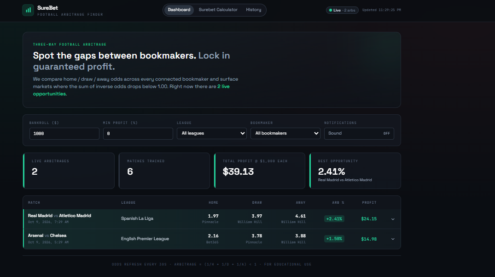

# SureBet — Football Arbitrage Finder

A lightweight full-stack app that pulls football (soccer) odds from multiple bookmakers, compares them, and surfaces **three-way arbitrage opportunities** (Home / Draw / Away) where you can split a stake across bookmakers and guarantee a profit.

> ⚠️ **For educational use.** Arbitrage betting carries real-world risks the math doesn't capture (limited stakes, voided bets, account restrictions, currency conversion, rule differences between books). Treat this as a learning project.

## How I built this

I wrote a detailed specification for this app (stack, data structures, API endpoints, arbitrage formula, stake allocation, filters and refresh behaviour), then used an AI coding agent to build it against that spec. I ran and tested it locally and worked through the code to understand how the backend refresh loop, the SQLite layer and the React dashboard fit together.


## Features

- Auto-refreshing odds dashboard (every 30s)
- Detects arbitrage opportunities via the standard `(1/H + 1/D + 1/A) < 1` test
- For each opportunity: best odds per outcome, source bookmakers, arb %, suggested stake split, guaranteed profit
- Filters: league, bookmaker, minimum profit %
- Bankroll input drives stake calculations
- Dark, responsive dashboard
- Sound notification when a new arb appears
- Standalone surebet calculator (enter any 3 odds + bankroll)
- Arbitrage history log (SQLite-backed)
- **Works out-of-the-box with realistic mock data** — no API key required to start
- Optionally plugs into [The Odds API](https://the-odds-api.com) (free tier: 500 req/month)

## Project layout

```
arb-finder/
├── backend/                # Express API + SQLite + refresh loop
│   ├── src/
│   │   ├── index.js              # entry point, refresh scheduler
│   │   ├── routes/api.js         # GET /matches, /arbitrage, /bookmakers, etc.
│   │   ├── services/
│   │   │   ├── oddsService.js    # The Odds API client + mock fallback
│   │   │   ├── arbService.js     # enriches matches with best odds + arb info
│   │   │   └── mockOdds.js       # realistic seed data with intentional arbs
│   │   └── db/
│   │       ├── index.js          # better-sqlite3 wrapper
│   │       └── schema.sql        # tables, indexes
│   ├── package.json
│   └── .env.example
├── frontend/               # React + Vite + Tailwind
│   ├── src/
│   │   ├── App.jsx
│   │   ├── components/           # Header, FiltersBar, ArbitrageTable, etc.
│   │   ├── hooks/usePolling.js
│   │   └── utils/{api.js,sound.js}
│   ├── tailwind.config.js
│   ├── vite.config.js            # /api proxied to localhost:4000
│   └── package.json
├── shared/
│   └── arbitrage.js              # pure functions used by both sides
└── README.md
```

## Quick start (5 commands)

You need Node.js ≥ 18 and npm.

```bash
# 1. Backend
cd backend
cp .env.example .env             # optional: paste your ODDS_API_KEY
npm install
npm run dev                      # http://localhost:4000

# 2. Frontend (new terminal)
cd frontend
npm install
npm run dev                      # http://localhost:5173
```

Open **http://localhost:5173** in your browser. The dashboard polls the backend every 30s; the backend polls upstream odds on the same cadence (configurable in `.env`).

### Run without an API key

If you don't paste an `ODDS_API_KEY`, the backend serves a built-in set of realistic mock matches. Three of them are seeded with genuine arbitrage opportunities (1–2% edge each), so the dashboard immediately shows green rows. Perfect for demos and development.

### Run with The Odds API

1. Sign up free at [https://the-odds-api.com](https://the-odds-api.com).
2. Paste the key into `backend/.env`:
   ```env
   ODDS_API_KEY=abc123...
   ODDS_API_SPORTS=soccer_epl,soccer_spain_la_liga,soccer_germany_bundesliga
   USE_MOCK_DATA=false
   ```
3. Restart the backend. Real bookmaker odds will start flowing in.

Sport keys are documented at [the-odds-api.com/sports-odds-data/sports-apis.html](https://the-odds-api.com/sports-odds-data/sports-apis.html). Examples:
- `soccer_epl` — English Premier League
- `soccer_spain_la_liga`
- `soccer_germany_bundesliga`
- `soccer_italy_serie_a`
- `soccer_france_ligue_one`
- `soccer_uefa_champs_league`

> **Rate limits:** the free tier is 500 requests/month. Each refresh consumes one request *per sport*. With the default 30s interval and 3 sports, that's ~8,640 requests/day — way over the free quota. For long-running dev/demo use, either bump `REFRESH_INTERVAL_SECONDS` (e.g. to `600` for 10-minute refreshes) or keep `USE_MOCK_DATA=true`.

## Arbitrage math (the whole idea, in one minute)

A football match has three mutually exclusive outcomes: Home win, Draw, Away win.

A decimal odd `O` means "stake 1 unit → receive `O` units if it wins (including your stake)". So the bookmaker's **implied probability** for that outcome is `1/O`.

Across all three outcomes, the implied probabilities must sum to **at least 1.0** for the bookmaker to have an edge. The amount above 1.0 is the *vig* (e.g. 1.05 → 5% margin in favor of the book).

But if you take the **best available odds across multiple bookmakers** — the highest H from book A, the highest D from book B, the highest A from book C — sometimes the combined implied probability sums to **less than 1.0**. When that happens:

```
arbitrage exists  ⇔  1/H + 1/D + 1/A  <  1
```

The guaranteed profit margin is:

```
arb%  =  (1 / (1/H + 1/D + 1/A))  -  1
```

To lock it in, split your bankroll `B` so the return is identical no matter which outcome wins:

```
stake_outcome  =  B × (1/odds_outcome) / (1/H + 1/D + 1/A)
```

The return on any winning leg is then `B / (1/H + 1/D + 1/A)`, which is greater than `B`.

**Worked example.** Suppose Bet365 prices Arsenal at 2.15, Pinnacle prices the draw at 3.85, William Hill prices Chelsea at 3.95. With a $1000 bankroll:

```
implied = 1/2.15 + 1/3.85 + 1/3.95 = 0.978       ← less than 1, so this is an arb
arb%    = 1/0.978 - 1                 = 2.25%

stake_home = 1000 × (1/2.15) / 0.978  = $475.57   on Arsenal @ Bet365
stake_draw = 1000 × (1/3.85) / 0.978  = $265.58   on Draw @ Pinnacle
stake_away = 1000 × (1/3.95) / 0.978  = $258.85   on Chelsea @ William Hill
                                       --------
                                       $1000.00   total stake

If Arsenal wins:  $475.57 × 2.15 = $1022.48
If Draw:          $265.58 × 3.85 = $1022.48
If Chelsea wins:  $258.85 × 3.95 = $1022.46
                                  --------
Guaranteed return ≈ $1022.47 → guaranteed profit $22.47 (2.25%)
```

All three branches return the same amount — that's the entire point. The math lives in [`shared/arbitrage.js`](shared/arbitrage.js).

## API reference

| Method | Path                                       | Description                                                                              |
| ------ | ------------------------------------------ | ---------------------------------------------------------------------------------------- |
| GET    | `/api/matches?bankroll=1000`               | All cached matches with best-odds info                                                   |
| GET    | `/api/arbitrage?bankroll=1000&minProfit=0` | Only arb matches, sorted by profit %, with stake split                                   |
| GET    | `/api/bookmakers`                          | Distinct bookmakers currently seen in odds data                                          |
| GET    | `/api/leagues`                             | Distinct leagues for the filter dropdown                                                 |
| GET    | `/api/history?limit=100`                   | Historical log of every unique arb detected                                              |
| GET    | `/api/favorites`                           | User's saved favorite leagues                                                            |
| POST   | `/api/favorites`                           | `{ "league": "..." }` — add a favorite                                                   |
| DELETE | `/api/favorites/:league`                   | Remove a favorite                                                                        |
| POST   | `/api/calculate`                           | `{ "homeOdds", "drawOdds", "awayOdds", "bankroll" }` — standalone surebet calc          |

### Sample response — `GET /api/arbitrage`

```json
{
  "count": 2,
  "bankroll": 1000,
  "arbitrages": [
    {
      "id": "mock-epl-1",
      "league": "English Premier League",
      "homeTeam": "Arsenal",
      "awayTeam": "Chelsea",
      "commenceTime": "2026-05-13T21:30:00.000Z",
      "bookmakers": [ /* ...raw odds from every book... */ ],
      "bestOdds": {
        "home": { "odds": 2.15, "bookmaker": "Bet365" },
        "draw": { "odds": 3.85, "bookmaker": "Pinnacle" },
        "away": { "odds": 3.95, "bookmaker": "William Hill" }
      },
      "impliedProbability": 0.978,
      "arbPercentage": 2.25,
      "isArbitrage": true,
      "stakeDistribution": { "home": 475.57, "draw": 265.58, "away": 258.85 },
      "guaranteedReturn": 1022.47,
      "profit": 22.47
    }
  ]
}
```

## Database schema (SQLite)

See [`backend/src/db/schema.sql`](backend/src/db/schema.sql) for the canonical version.

- **`matches`** — `(id PK, league, home_team, away_team, commence_time, updated_at)`
- **`odds`** — `(id PK, match_id FK, bookmaker_key, bookmaker_name, home_odds, draw_odds, away_odds, fetched_at)` with `UNIQUE(match_id, bookmaker_key)`
- **`arb_history`** — every unique arbitrage detected, for the History tab
- **`favorite_leagues`** — `(league PK, added_at)`

The DB file is created automatically at `backend/data.sqlite` on first boot.

## UI overview

The dashboard is dark-themed with green accents reserved for actual arb signals:

```
┌─────────────────────────────────────────────────────────────────────────┐
│  ●  SureBet                  [Dashboard] [Calculator] [History]    ● Live │
│     Football Arbitrage Finder                                  2 arbs    │
├─────────────────────────────────────────────────────────────────────────┤
│  THREE-WAY FOOTBALL ARBITRAGE                                           │
│  Spot the gaps between bookmakers. Lock in guaranteed profit.           │
│                                                                          │
│  ┌─Bankroll─┬─Min %─┬─League──────┬─Bookmaker──┬─Sound─┐                │
│  │   1000   │  0.0  │ All leagues │ All        │  On   │                │
│  └──────────┴───────┴─────────────┴────────────┴───────┘                │
│                                                                          │
│  ┌──────────────┬──────────────┬──────────────┬──────────────┐          │
│  │ LIVE ARBS    │ MATCHES      │ TOTAL PROFIT │ BEST OPP.    │          │
│  │      2       │      6       │    $36.72    │    2.25%     │          │
│  └──────────────┴──────────────┴──────────────┴──────────────┘          │
│                                                                          │
│  ┃ Arsenal vs Chelsea       EPL    2.15  3.85  3.95   +2.25%  $22.47  ▾ │
│  ┃   ↳ Bet365 / Pinnacle / William Hill                                  │
│  ┃ Real Madrid vs Atletico  LaLiga 1.95  3.90  4.60   +1.42%  $14.21  ▾ │
│   Manchester City vs Liverpool EPL ...                                   │
└─────────────────────────────────────────────────────────────────────────┘
```

Click any row to expand a stake-distribution table showing exactly how much to put on each leg.

## Bonus features included

- ✅ **Sound notification** when a new arb appears (Web Audio synth — no asset files)
- ✅ **Profit history** — `/api/history` + `History` tab in UI
- ✅ **Surebet calculator** — standalone page that takes arbitrary odds + bankroll
- ✅ **Favorite leagues** — endpoint pair `GET/POST/DELETE /api/favorites` (UI hookup left as a 5-min exercise)
- ⏳ **Telegram alerts** — not wired up; add a webhook call in `backend/src/index.js` inside the `for (const arb of arbs)` block where new arbs are logged
- ⏳ **Kelly criterion** — would belong in `shared/arbitrage.js` as `kellyFraction(p, b) = (p*(b+1) - 1) / b`; not used by the core arb logic since arbs are risk-free anyway

## Production build

```bash
# Backend (no build step needed)
cd backend && npm install --omit=dev && npm start

# Frontend
cd frontend && npm install && npm run build      # outputs to dist/
```

Serve `frontend/dist/` from any static host. Set `VITE_API_BASE=https://your-backend.example.com/api` at build time if the backend lives on a different origin.

## Troubleshooting

- **`better-sqlite3` install fails** — it's a native module. Make sure you have Python and a C++ compiler installed (Node.js usually bundles `node-gyp`). On Windows, `npm install --global windows-build-tools` (run as admin) can help. On Linux, `sudo apt install build-essential python3`.
- **CORS errors in the browser** — make sure both servers are running and that you're hitting the Vite dev server at `:5173`, not the backend directly at `:4000`. The Vite proxy in `vite.config.js` forwards `/api/*` for you.
- **Zero arbitrages forever** — that's the honest case in live data; arbs are rare and short-lived. Either lower the `Min profit %` filter to `0`, or set `USE_MOCK_DATA=true` to see what a populated dashboard looks like.

## License

MIT — do whatever, no warranty, don't bet money you can't lose.
